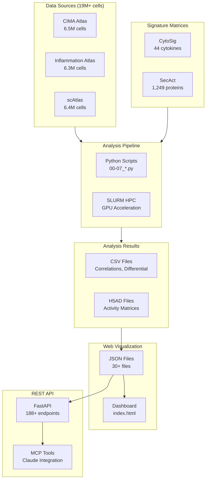

# CytoAtlas Project Architecture

High-level overview of the Pan-Disease Single-Cell Cytokine Activity Atlas project.

## System Architecture



## Core Components

### 1. Data Layer

| Component | Location | Description |
|-----------|----------|-------------|
| H5AD Files | `/data/Jiang_Lab/Data/Seongyong/` | Raw single-cell data in AnnData format |
| Signature Matrices | `secactpy` package | CytoSig and SecAct signature matrices |
| Metadata | CSV files | Sample-level clinical and experimental data |

### 2. Analysis Layer

| Component | Location | Description |
|-----------|----------|-------------|
| Analysis Scripts | `scripts/*.py` | Main analysis pipelines |
| SLURM Scripts | `scripts/slurm/*.sh` | HPC job submission |
| SecActpy | External package | Ridge regression for activity inference |

### 3. Output Layer

| Component | Location | Description |
|-----------|----------|-------------|
| Results | `results/` | CSV and H5AD analysis outputs |
| JSON Data | `visualization/data/` | Web-optimized JSON files |
| Figures | `results/figures/` | Publication-quality figures |

### 4. Presentation Layer

| Component | Location | Description |
|-----------|----------|-------------|
| Dashboard | `visualization/index.html` | Interactive web visualization |
| REST API | `cytoatlas-api/` | FastAPI backend (188+ endpoints) |
| Documentation | `docs/` | Project documentation |

## Analysis Pipeline

### Phase 0: Pilot Validation
Validate methodology on 100K cell subsets from each atlas.

### Phase 1-3: Atlas-Specific Analysis
Compute activities and statistical analyses for each atlas independently.

### Phase 4: Cross-Atlas Integration
Compare patterns across atlases for conserved and atlas-specific signatures.

### Phase 5: Visualization
Preprocess results into JSON for web dashboard consumption.

## Key Technical Decisions

### Activity Calculation

Uses **ridge regression** with permutation-based p-values:
```python
result = ridge_batch(
    X=signature_matrix,    # genes × proteins
    Y=expression_matrix,   # genes × samples
    lambda_=5e5,           # regularization
    n_rand=1000,           # permutations
)
```

### Activity Difference (not Log2FC)

Activities are z-scores that can be negative, so we use simple difference:
```python
activity_diff = group1_mean - group2_mean  # NOT log2(group1/group2)
```

### Pseudo-bulk Aggregation

Primary analysis level aggregates cells by sample × cell type:
1. Sum raw counts per group
2. TPM normalize
3. Log2 transform
4. Subtract row mean (differential expression)
5. Ridge regression

### Memory Efficiency

- **Backed mode**: H5AD files loaded with `backed='r'`
- **Chunked processing**: 50K cells per chunk
- **GPU acceleration**: CuPy for 10-34x speedup

## Technology Stack

| Layer | Technologies |
|-------|--------------|
| Analysis | Python, NumPy, Pandas, SciPy, AnnData |
| GPU | CuPy (NVIDIA CUDA) |
| HPC | SLURM, NIH Biowulf |
| API | FastAPI, Pydantic |
| Visualization | Plotly.js, D3.js, HTML/CSS/JS |
| Documentation | Markdown, Mermaid diagrams |

## File Naming Conventions

### Analysis Outputs
- `{atlas}_{analysis_type}.csv` - Tabular results
- `{atlas}_{signature}_pseudobulk.h5ad` - Activity matrices
- `{atlas}_{signature}_singlecell.h5ad` - Per-cell activities

### JSON Files
- `{atlas}_{panel}.json` - Panel-specific data
- `{atlas}_{panel}_filtered.json` - Size-optimized version
- `{atlas}_{panel}_top.json` - Top N results

## API Structure

```
cytoatlas-api/
├── app/
│   ├── main.py              # FastAPI application
│   ├── routers/             # API endpoints by atlas
│   ├── services/            # Business logic
│   ├── schemas/             # Pydantic models
│   └── core/                # Configuration, security
```

### Key Routers
| Router | Endpoints | Description |
|--------|-----------|-------------|
| `/api/v1/cima/` | ~32 | CIMA correlations, differential |
| `/api/v1/inflammation/` | ~44 | Disease, treatment response |
| `/api/v1/scatlas/` | ~36 | Organs, cancer, exhaustion |
| `/api/v1/cross-atlas/` | ~28 | Cross-atlas comparison |
| `/api/v1/validation/` | ~12 | 5-type credibility assessment |

## Getting Started

### Environment Setup
```bash
source ~/bin/myconda
conda activate secactpy
```

### Run Analysis
```bash
# Full pipeline
sbatch scripts/slurm/run_all.sh

# Individual atlas
python scripts/01_cima_activity.py
```

### Start API
```bash
cd cytoatlas-api
uvicorn app.main:app --reload
```

### View Dashboard
Open `visualization/index.html` in a browser.

## Related Documentation

- [Datasets](datasets/README.md) - Data source details
- [Pipelines](pipelines/README.md) - Analysis pipeline docs
- [Outputs](outputs/README.md) - Output file documentation
- [API Mapping](outputs/visualization/api_mapping.md) - JSON to API mapping
