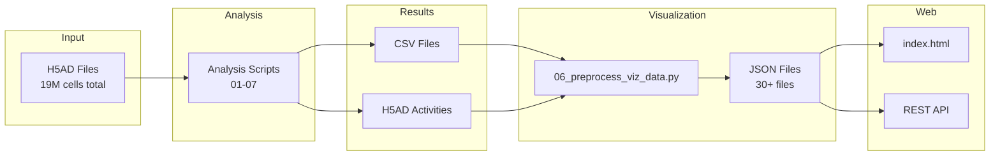

# Output Documentation

This directory documents all output files generated by the CytoAtlas analysis pipelines.

## Output Structure

```
outputs/
├── results/                 # Analysis results (CSV/H5AD)
│   ├── cima.md              # CIMA output files
│   ├── inflammation.md      # Inflammation output files
│   └── scatlas.md           # scAtlas output files
└── visualization/           # Web dashboard data (JSON)
    ├── index.md             # Complete JSON catalog
    ├── api_mapping.md       # JSON → API endpoint mapping
    └── panel_mapping.md     # JSON → UI panel mapping
```

## File Types

| Extension | Location | Purpose |
|-----------|----------|---------|
| `.csv` | `results/` | Tabular analysis results |
| `.h5ad` | `results/` | Activity matrices (AnnData format) |
| `.json` | `visualization/data/` | Web dashboard data |

## Data Lineage



## Disk Usage Summary

| Directory | Size | Files |
|-----------|------|-------|
| `results/cima/` | ~500 MB | ~20 files |
| `results/inflammation/` | ~1 GB | ~30 files |
| `results/scatlas/` | ~25 GB | ~40 files (includes single-cell) |
| `visualization/data/` | ~900 MB | ~40 files |

## Quick Reference

### Most Used Files

| File | Atlas | Description | Size |
|------|-------|-------------|------|
| `cima_correlations.json` | CIMA | Age/BMI correlations | 3 MB |
| `inflammation_disease_filtered.json` | Inflammation | Disease differential | 56 MB |
| `scatlas_organs.json` | scAtlas | Organ signatures | 6 MB |
| `cancer_comparison.json` | scAtlas | Tumor vs Adjacent | 256 KB |

### Activity H5AD Files

| File | Atlas | Signatures | Samples |
|------|-------|------------|---------|
| `CIMA_CytoSig_pseudobulk.h5ad` | CIMA | 44 | ~11K |
| `main_CytoSig_pseudobulk.h5ad` | Inflammation | 44 | ~50K |
| `normal_organ_signatures.csv` | scAtlas | 44 + 1,249 | ~1K |
