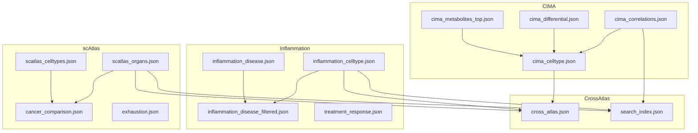

# Visualization JSON Catalog

Complete catalog of JSON files for the web dashboard.

## Overview

| Category | Files | Total Size |
|----------|-------|------------|
| CIMA | 9 | ~45 MB |
| Inflammation | 12 | ~365 MB |
| scAtlas | 9 | ~95 MB |
| Cross-Atlas | 4 | ~1 MB |
| **Total** | **34** | **~506 MB** |

## File Catalog

### CIMA Files

| File | Size | Records | Description |
|------|------|---------|-------------|
| `cima_correlations.json` | 2.9 MB | ~10K | Age/BMI/biochemistry correlations |
| `cima_differential.json` | 3.3 MB | ~5K | Sex/smoking differential |
| `cima_metabolites_top.json` | 83 KB | 500 | Top metabolite correlations |
| `cima_celltype.json` | 4.4 MB | ~5K | Cell type activities |
| `cima_celltype_correlations.json` | 9.1 MB | ~15K | Cell type-specific correlations |
| `cima_biochem_scatter.json` | 8.2 MB | ~10K | Biochemistry scatter plot data |
| `cima_eqtl.json` | 14 MB | ~50K | eQTL associations |
| `cima_eqtl_top.json` | 2.0 MB | ~5K | Top eQTL results |
| `cima_population_stratification.json` | 126 KB | ~1K | Population stratification |

### Inflammation Files

| File | Size | Records | Description |
|------|------|---------|-------------|
| `inflammation_celltype.json` | 5.0 MB | ~80K | Cell type activities |
| `inflammation_celltype_correlations.json` | 2.7 MB | ~10K | Cell type correlations |
| `inflammation_correlations.json` | 303 KB | ~3K | Age/BMI correlations |
| `inflammation_differential.json` | 1.6 MB | ~10K | Key differential results |
| `inflammation_disease.json` | 275 MB | ~200K | Full disease differential |
| `inflammation_disease_filtered.json` | 56 MB | ~50K | Filtered disease differential |
| `inflammation_severity.json` | 11 MB | ~30K | Disease severity associations |
| `inflammation_severity_filtered.json` | 2.2 MB | ~5K | Filtered severity |
| `inflammation_cell_drivers.json` | 7.3 MB | ~20K | Cell type disease drivers |
| `inflammation_longitudinal.json` | 5.9 MB | ~10K | Longitudinal data |
| `treatment_response.json` | 235 KB | ~2K | Treatment response |
| `cohort_validation.json` | 182 KB | ~1K | Cross-cohort validation |

### scAtlas Files

| File | Size | Records | Description |
|------|------|---------|-------------|
| `scatlas_organs.json` | 5.8 MB | ~50K | Organ signatures |
| `scatlas_organs_top.json` | 129 KB | ~500 | Top organ markers |
| `scatlas_celltypes.json` | 30 MB | ~100K | Cell type signatures |
| `cancer_comparison.json` | 256 KB | ~20K | Tumor vs Adjacent |
| `cancer_types.json` | 4.3 MB | ~30K | Cancer type activities |
| `exhaustion.json` | 6.3 MB | ~10K | T cell exhaustion |
| `immune_infiltration.json` | 37 MB | ~50K | Immune infiltration |
| `caf_signatures.json` | 1.8 MB | ~5K | CAF signatures |
| `organ_cancer_matrix.json` | 5.2 MB | ~10K | Organ × cancer matrix |
| `adjacent_tissue.json` | 5.3 MB | ~10K | Adjacent tissue signatures |

### Cross-Atlas Files

| File | Size | Records | Description |
|------|------|---------|-------------|
| `cross_atlas.json` | 186 KB | ~1K | Atlas comparison |
| `search_index.json` | 325 KB | ~10K | Global search index |
| `summary_stats.json` | 1.8 KB | 1 | Project summary |
| `disease_sankey.json` | 5.4 KB | ~50 | Disease flow diagram |

### Large Files (>50 MB)

| File | Size | Purpose | Note |
|------|------|---------|------|
| `age_bmi_boxplots.json` | 235 MB | Sample-level boxplots | Use filtered version |
| `age_bmi_boxplots_filtered.json` | 115 MB | Filtered boxplots | Preferred |
| `inflammation_disease.json` | 275 MB | Full disease data | Use filtered version |
| `inflammation_disease_filtered.json` | 56 MB | Filtered disease | Preferred |
| `embedded_data.js` | 434 MB | Pre-embedded data | For offline mode |

## Schema Reference

### Correlation Schema

```json
{
  "cell_type": "string",
  "signature": "string",
  "signature_type": "CytoSig | SecAct",
  "rho": "number (-1 to 1)",
  "pvalue": "number (0 to 1)",
  "fdr": "number (0 to 1)",
  "n_samples": "number"
}
```

### Differential Schema

```json
{
  "cell_type": "string",
  "signature": "string",
  "signature_type": "CytoSig | SecAct",
  "comparison": "string (e.g., 'disease_RA_vs_Healthy')",
  "group1": "string",
  "group2": "string",
  "median_g1": "number",
  "median_g2": "number",
  "activity_diff": "number (group1 - group2)",
  "pvalue": "number",
  "fdr": "number",
  "neg_log10_pval": "number"
}
```

### Activity Schema

```json
{
  "cell_type": "string",
  "signature": "string",
  "signature_type": "CytoSig | SecAct",
  "mean_activity": "number (z-score)",
  "n_cells": "number",
  "organ": "string (optional)",
  "disease": "string (optional)"
}
```

### Cancer Comparison Schema

```json
{
  "data": [
    {
      "cell_type": "string",
      "signature": "string",
      "signature_type": "CytoSig | SecAct",
      "mean_tumor": "number",
      "mean_adjacent": "number",
      "mean_difference": "number",
      "std_difference": "number",
      "n_pairs": "number",
      "p_value": "number"
    }
  ],
  "cell_types": ["string"],
  "cytosig_signatures": ["string"],
  "secact_signatures": ["string"],
  "n_paired_donors": "number",
  "analysis_type": "paired_singlecell"
}
```

## File Relationships


