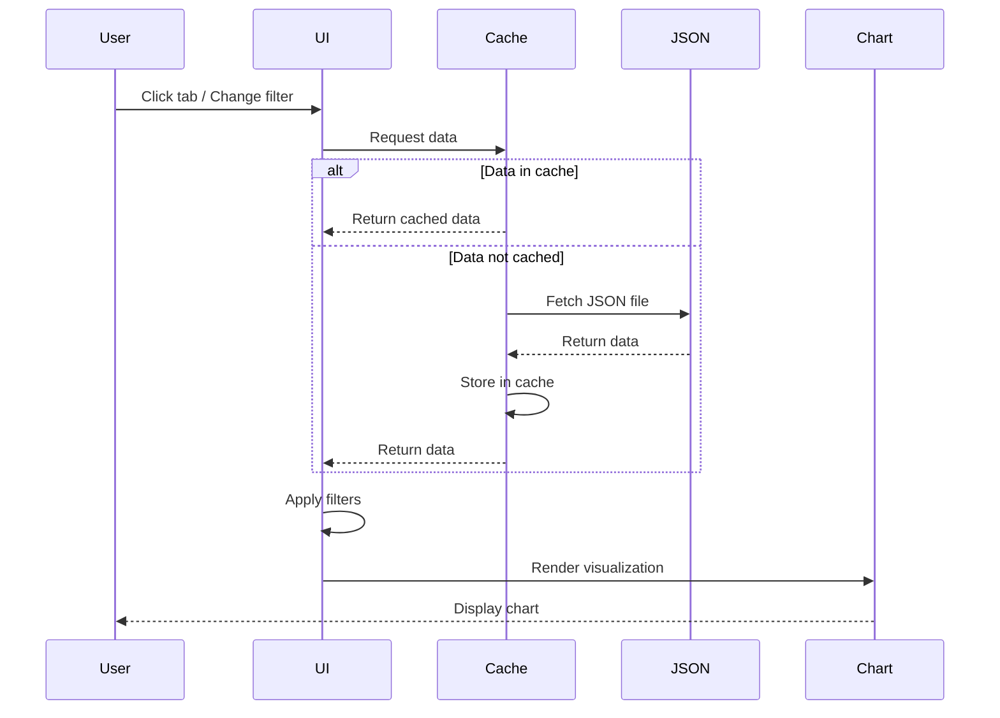

# JSON to UI Panel Mapping

Maps visualization JSON files to their corresponding UI components in the web dashboard.

## Overview

The web dashboard (`visualization/index.html`) loads JSON data and renders it in various visualization panels.

## Dashboard Structure

```
┌─────────────────────────────────────────────────────────────────┐
│  CytoAtlas Dashboard                                            │
├─────────────────────────────────────────────────────────────────┤
│  [CIMA] [Inflammation] [scAtlas] [Cross-Atlas] [Validation]     │
├─────────────────────────────────────────────────────────────────┤
│                                                                 │
│  ┌─────────────────────┐  ┌─────────────────────┐               │
│  │ Signature Selector  │  │ Cell Type Filter    │               │
│  └─────────────────────┘  └─────────────────────┘               │
│                                                                 │
│  ┌─────────────────────────────────────────────────────────┐    │
│  │                                                         │    │
│  │                    Main Visualization                   │    │
│  │                   (Charts/Heatmaps/etc)                │    │
│  │                                                         │    │
│  └─────────────────────────────────────────────────────────┘    │
│                                                                 │
│  ┌─────────────────────────────────────────────────────────┐    │
│  │                    Data Table                           │    │
│  └─────────────────────────────────────────────────────────┘    │
└─────────────────────────────────────────────────────────────────┘
```

## Panel Mapping

### CIMA Tab

| Panel | JSON File | Update Function | Chart Type |
|-------|-----------|-----------------|------------|
| Age Correlation | `cima_correlations.json` | `updateCimaAgeCorrelation()` | Scatter + heatmap |
| BMI Correlation | `cima_correlations.json` | `updateCimaBmiCorrelation()` | Scatter + heatmap |
| Biochemistry | `cima_correlations.json` | `updateCimaBiochemistry()` | Heatmap |
| Metabolites | `cima_metabolites_top.json` | `updateCimaMetabolites()` | Heatmap |
| Sex Differential | `cima_differential.json` | `updateCimaDifferential()` | Volcano plot |
| Smoking Differential | `cima_differential.json` | `updateCimaDifferential()` | Volcano plot |
| Cell Type Heatmap | `cima_celltype.json` | `updateCimaCelltype()` | Heatmap |
| eQTL | `cima_eqtl_top.json` | `updateCimaEqtl()` | Manhattan + table |

### Inflammation Tab

| Panel | JSON File | Update Function | Chart Type |
|-------|-----------|-----------------|------------|
| Disease Overview | `inflammation_disease_filtered.json` | `updateInflamDisease()` | Heatmap |
| Disease Detail | `inflammation_disease_filtered.json` | `updateInflamDiseaseDetail()` | Volcano + bar |
| Severity | `inflammation_severity_filtered.json` | `updateInflamSeverity()` | Scatter |
| Cell Type Activity | `inflammation_celltype.json` | `updateInflamCelltype()` | Heatmap |
| Treatment Response | `treatment_response.json` | `updateTreatmentResponse()` | ROC + bar |
| Cohort Validation | `cohort_validation.json` | `updateCohortValidation()` | Scatter + table |
| Longitudinal | `inflammation_longitudinal.json` | `updateInflamLongitudinal()` | Line chart |
| Cell Drivers | `inflammation_cell_drivers.json` | `updateCellDrivers()` | Heatmap |

### scAtlas Tab

| Panel | JSON File | Update Function | Chart Type |
|-------|-----------|-----------------|------------|
| Organ Signatures | `scatlas_organs.json` | `updateScatlasOrgans()` | Heatmap |
| Top Organ Markers | `scatlas_organs_top.json` | `updateScatlasOrgansTop()` | Bar chart |
| Cell Type Activity | `scatlas_celltypes.json` | `updateScatlasCelltypes()` | Heatmap |
| Cancer Comparison | `cancer_comparison.json` | `updateCancerComparison()` | Heatmap + volcano |
| Cancer Types | `cancer_types.json` | `updateCancerTypes()` | Heatmap |
| T Cell Exhaustion | `exhaustion.json` | `updateExhaustion()` | Volcano + heatmap |
| Immune Infiltration | `immune_infiltration.json` | `updateImmuneInfiltration()` | Heatmap |
| CAF Signatures | `caf_signatures.json` | `updateCafSignatures()` | Heatmap |

### Cross-Atlas Tab

| Panel | JSON File | Update Function | Chart Type |
|-------|-----------|-----------------|------------|
| Atlas Comparison | `cross_atlas.json` | `updateCrossAtlas()` | Heatmap + scatter |
| Conserved Signatures | `cross_atlas.json` | `updateConservedSignatures()` | Bar chart |

### Validation Tab

| Panel | JSON File | Update Function | Chart Type |
|-------|-----------|-----------------|------------|
| 5-Type Validation | `validation/*.json` | `updateValidation()` | Tables + charts |

## JavaScript Functions

### Data Loading

```javascript
// Load JSON data
async function loadData(filename) {
    const response = await fetch(`data/${filename}`);
    return await response.json();
}

// Cache management
const dataCache = {};
async function getCachedData(filename) {
    if (!dataCache[filename]) {
        dataCache[filename] = await loadData(filename);
    }
    return dataCache[filename];
}
```

### Panel Updates

```javascript
// Update CIMA correlation panel
async function updateCimaAgeCorrelation() {
    const data = await getCachedData('cima_correlations.json');
    const ageData = data.age.filter(d =>
        d.signature_type === currentSignatureType &&
        (currentCellType === 'All' || d.cell_type === currentCellType)
    );
    renderCorrelationHeatmap('cima-age-heatmap', ageData);
}

// Update inflammation disease panel
async function updateInflamDisease() {
    const data = await getCachedData('inflammation_disease_filtered.json');
    const filtered = data.filter(d =>
        d.signature_type === currentSignatureType &&
        Math.abs(d.activity_diff) > 0.5
    );
    renderDiseaseHeatmap('inflam-disease-heatmap', filtered);
}
```

### Chart Rendering

```javascript
// Render heatmap using Plotly
function renderHeatmap(containerId, data, xField, yField, zField) {
    const trace = {
        x: [...new Set(data.map(d => d[xField]))],
        y: [...new Set(data.map(d => d[yField]))],
        z: buildZMatrix(data, xField, yField, zField),
        type: 'heatmap',
        colorscale: 'RdBu'
    };
    Plotly.newPlot(containerId, [trace], layout);
}

// Render volcano plot
function renderVolcano(containerId, data) {
    const trace = {
        x: data.map(d => d.activity_diff),
        y: data.map(d => d.neg_log10_pval),
        mode: 'markers',
        text: data.map(d => `${d.signature} (${d.cell_type})`),
        type: 'scatter'
    };
    Plotly.newPlot(containerId, [trace], volcanoLayout);
}
```

## Event Handlers

### Signature Type Toggle

```javascript
document.getElementById('signature-toggle').addEventListener('change', (e) => {
    currentSignatureType = e.target.checked ? 'SecAct' : 'CytoSig';
    updateAllPanels();
});
```

### Cell Type Filter

```javascript
document.getElementById('celltype-select').addEventListener('change', (e) => {
    currentCellType = e.target.value;
    updateCurrentTabPanels();
});
```

### Tab Navigation

```javascript
document.querySelectorAll('.tab-button').forEach(btn => {
    btn.addEventListener('click', (e) => {
        currentTab = e.target.dataset.tab;
        showTab(currentTab);
        updateCurrentTabPanels();
    });
});
```

## Data Flow



## Performance Considerations

### Lazy Loading

```javascript
// Only load data when tab is activated
const tabDataLoaded = {};

async function showTab(tabName) {
    if (!tabDataLoaded[tabName]) {
        await preloadTabData(tabName);
        tabDataLoaded[tabName] = true;
    }
}
```

### Filtered Data Files

For large datasets, use filtered versions:

| Full File | Filtered File | Use Case |
|-----------|---------------|----------|
| `inflammation_disease.json` (275MB) | `inflammation_disease_filtered.json` (56MB) | Initial load |
| `age_bmi_boxplots.json` (235MB) | `age_bmi_boxplots_filtered.json` (115MB) | Boxplot view |

### Chunked Rendering

```javascript
// Render large heatmaps in chunks
async function renderLargeHeatmap(containerId, data, chunkSize = 1000) {
    for (let i = 0; i < data.length; i += chunkSize) {
        const chunk = data.slice(i, i + chunkSize);
        await new Promise(resolve => setTimeout(resolve, 0));
        appendHeatmapChunk(containerId, chunk);
    }
}
```
