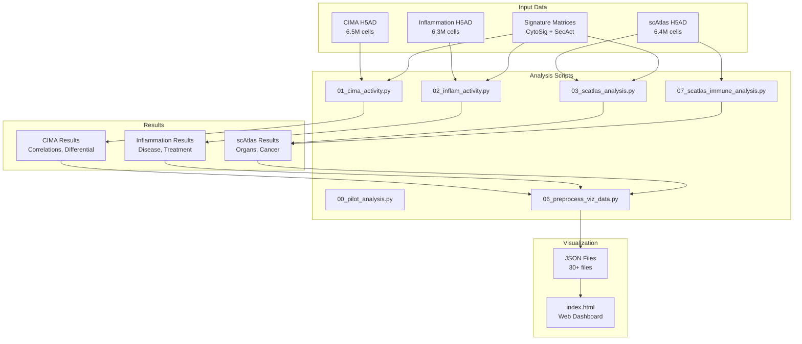
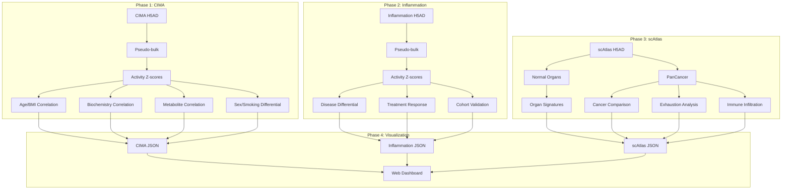

# Pipeline Documentation

This directory contains documentation for all analysis pipelines in the CytoAtlas project.

## Pipeline Overview



## Script Summary

| Phase | Script | Description | Runtime | GPU |
|-------|--------|-------------|---------|-----|
| 0 | `00_pilot_analysis.py` | Validation on 100K cell subsets | ~30 min | Yes |
| 1 | `01_cima_activity.py` | CIMA activity + correlations | ~2 hr | Yes |
| 2 | `02_inflam_activity.py` | Inflammation activity + disease analysis | ~3 hr | Yes |
| 3 | `03_scatlas_analysis.py` | scAtlas organs + cancer comparison | ~4 hr | Yes |
| 3b | `07_scatlas_immune_analysis.py` | Immune infiltration + exhaustion | ~2 hr | Yes |
| 4 | `06_preprocess_viz_data.py` | JSON preprocessing for web | ~30 min | No |

## Common Processing Steps

All activity pipelines follow this pattern:


### Step 1: Aggregation
Cells are grouped by sample and cell type to create pseudo-bulk profiles:
```python
expr_df, meta_df = aggregate_by_sample_celltype(adata, cell_type_col, sample_col)
```

### Step 2: Normalization
TPM normalization followed by log2 transformation:
```python
expr_log = normalize_and_transform(expr_df)
```

### Step 3: Differential Expression
Center by subtracting row means:
```python
expr_diff = compute_differential(expr_log)
```

### Step 4: Activity Inference
Ridge regression against signature matrices:
```python
result = run_activity_inference(expr_diff, signature, sig_name)
```

## Pipeline Details

### Phase 0: Pilot Analysis
- [Pilot Validation](pilot.md)

### Phase 1: CIMA Analysis
- [CIMA Activity Pipeline](cima/activity.md)
- [Age/BMI/Biochemistry Correlations](cima/panels/correlations.md)
- [Metabolite Analysis](cima/panels/metabolites.md)
- [Sex/Smoking Differential](cima/panels/differential.md)

### Phase 2: Inflammation Analysis
- [Inflammation Activity Pipeline](inflammation/activity.md)
- [Disease Differential](inflammation/panels/disease.md)
- [Treatment Response](inflammation/panels/treatment.md)
- [Cross-Cohort Validation](inflammation/panels/validation.md)

### Phase 3: scAtlas Analysis
- [scAtlas Activity Pipeline](scatlas/analysis.md)
- [Organ Signatures](scatlas/panels/organs.md)
- [Cancer Comparison](scatlas/panels/cancer.md)
- [T Cell Exhaustion](scatlas/panels/exhaustion.md)
- [Immune Infiltration](scatlas/immune.md)

### Phase 4: Visualization
- [JSON Preprocessing](visualization/preprocess.md)

## Execution

### SLURM (Recommended)

```bash
# Full pipeline
sbatch scripts/slurm/run_all.sh

# Individual analyses
sbatch scripts/slurm/run_cima.sh
sbatch scripts/slurm/run_inflam.sh
sbatch scripts/slurm/run_scatlas.sh
```

### Direct Execution

```bash
cd /data/parks34/projects/2secactpy

# Activate environment
source ~/bin/myconda
conda activate secactpy

# Run scripts
python scripts/01_cima_activity.py --mode pseudobulk
python scripts/02_inflam_activity.py --mode both
python scripts/03_scatlas_analysis.py
python scripts/06_preprocess_viz_data.py
```

## Key Parameters

| Parameter | Default | Description |
|-----------|---------|-------------|
| `BATCH_SIZE` | 10,000 | Cells per batch for single-cell analysis |
| `N_RAND` | 1,000 | Permutations for p-value calculation |
| `LAMBDA` | 5e5 | Ridge regression regularization |
| `SEED` | 0 | Random seed for reproducibility |
| `BACKEND` | cupy/numpy | Computation backend (GPU if available) |

## Data Flow Diagram


