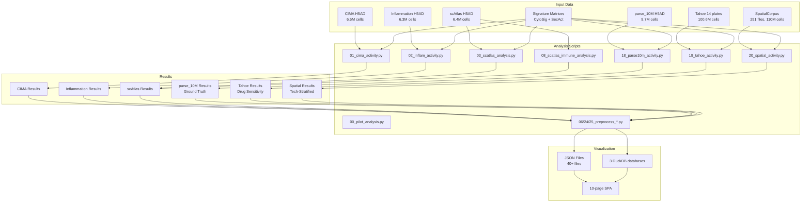
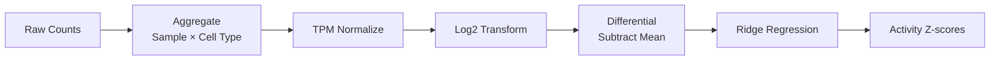
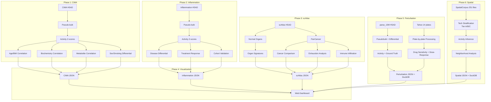

# Pipeline Documentation

This directory contains documentation for all analysis pipelines in the CytoAtlas project.

## Pipeline Overview



## Script Summary

| Phase | Script | Description | Runtime | GPU |
|-------|--------|-------------|---------|-----|
| 0 | `00_pilot_analysis.py` | Validation on 100K cell subsets | ~30 min | Yes |
| 1 | `01_cima_activity.py` | CIMA activity + correlations | ~2 hr | Yes |
| 2 | `02_inflam_activity.py` | Inflammation activity + disease analysis | ~3 hr | Yes |
| 3 | `03_scatlas_analysis.py` | scAtlas organs + cancer comparison | ~4 hr | Yes |
| 4 | `04_integrated.py` | Cross-atlas integration | ~1 hr | No |
| 5 | `05_figures.py` | Publication figures (matplotlib) | ~30 min | No |
| 6 | `06_preprocess_viz_data.py` | JSON preprocessing for web | ~30 min | No |
| 7 | `07_cross_atlas_analysis.py` | Cross-atlas comparison | ~1 hr | No |
| 8 | `08_scatlas_immune_analysis.py` | Immune infiltration + exhaustion | ~2 hr | Yes |
| 10 | `10_atlas_validation_pipeline.py` | Multi-level atlas validation | ~2 hr | Yes |
| 11 | `11_donor_level_pipeline.py` | Donor-level analysis pipeline | ~1 hr | Yes |
| 14 | `14_preprocess_bulk_validation.py` | JSON preprocessing for validation viz | ~30 min | No |
| 15 | `15_bulk_validation.py` | GTEx/TCGA bulk RNA-seq activity | ~1 hr | Yes |
| 16 | `16_resampled_validation.py` | Bootstrap resampled activity inference | ~2 hr | Yes |
| 17 | `17_preprocess_validation_summary.py` | Validation summary preprocessing | ~15 min | No |
| 18 | `18_parse10m_activity.py` | parse_10M cytokine perturbation activity | ~24 hr | Yes |
| 19 | `19_tahoe_activity.py` | Tahoe drug-response activity (14 plates) | ~48 hr | Yes |
| 20 | `20_spatial_activity.py` | SpatialCorpus technology-stratified activity | ~48-72 hr | Yes |
| 21 | `21_parse10m_ground_truth.py` | CytoSig ground-truth validation | ~8 hr | Yes |
| 22 | `22_tahoe_drug_signatures.py` | Drug sensitivity signature extraction | ~8 hr | Yes |
| 23 | `23_spatial_neighborhood.py` | Spatial neighborhood activity analysis | ~16 hr | Yes |
| 24 | `24_preprocess_perturbation_viz.py` | Perturbation JSON/DuckDB preprocessing | ~6 hr | No |
| 25 | `25_preprocess_spatial_viz.py` | Spatial JSON/DuckDB preprocessing | ~6 hr | No |

## Common Processing Steps

All activity pipelines follow this pattern:



### Step 1: Aggregation
Cells are grouped by sample and cell type to create pseudo-bulk profiles:
```python
expr_df, meta_df = aggregate_by_sample_celltype(adata, cell_type_col, sample_col)
```

### Step 2: Normalization
TPM normalization followed by log2 transformation:
```python
expr_log = normalize_and_transform(expr_df)
```

### Step 3: Differential Expression
Center by subtracting row means:
```python
expr_diff = compute_differential(expr_log)
```

### Step 4: Activity Inference
Ridge regression against signature matrices:
```python
result = run_activity_inference(expr_diff, signature, sig_name)
```

## Pipeline Details

### Phase 0: Pilot Analysis
- Script: `scripts/00_pilot_analysis.py` — validation on 100K cell subsets

### Phase 1: CIMA Analysis
- [CIMA Activity Pipeline](cima/activity.md) — age/BMI correlations, biochemistry, metabolites, differential

### Phase 2: Inflammation Analysis
- [Inflammation Activity Pipeline](inflammation/activity.md) — disease differential, treatment response, cross-cohort validation

### Phase 3: scAtlas Analysis
- [scAtlas Activity Pipeline](scatlas/analysis.md) — organ signatures, cancer comparison, immune infiltration

### Phase 5: Perturbation Analysis
- [parse_10M Activity Pipeline](perturbation/parse10m.md) — Cytokine perturbation activity + ground truth validation
- [Tahoe Drug Response Pipeline](perturbation/tahoe.md) — Drug-response activity + sensitivity + dose-response

### Phase 6: Spatial Analysis
- [SpatialCorpus Activity Pipeline](spatial/activity.md) — Technology-stratified activity + neighborhood analysis

### Phase 7: Visualization Preprocessing
- [JSON Preprocessing](visualization/preprocess.md)

## Execution

### SLURM (Recommended)

```bash
# Full pipeline
sbatch scripts/slurm/run_all.sh

# Individual analyses
sbatch scripts/slurm/run_cima.sh
sbatch scripts/slurm/run_inflam.sh
sbatch scripts/slurm/run_scatlas.sh
```

### Direct Execution

```bash
cd /data/parks34/projects/2secactpy

# Activate environment
source ~/bin/myconda
conda activate secactpy

# Run scripts
python scripts/01_cima_activity.py --mode pseudobulk
python scripts/02_inflam_activity.py --mode both
python scripts/03_scatlas_analysis.py
python scripts/06_preprocess_viz_data.py
```

## Key Parameters

| Parameter | Default | Description |
|-----------|---------|-------------|
| `BATCH_SIZE` | 10,000 | Cells per batch for single-cell analysis |
| `N_RAND` | 1,000 | Permutations for p-value calculation |
| `LAMBDA` | 5e5 | Ridge regression regularization |
| `SEED` | 0 | Random seed for reproducibility |
| `BACKEND` | cupy/numpy | Computation backend (GPU if available) |

## Data Flow Diagram


