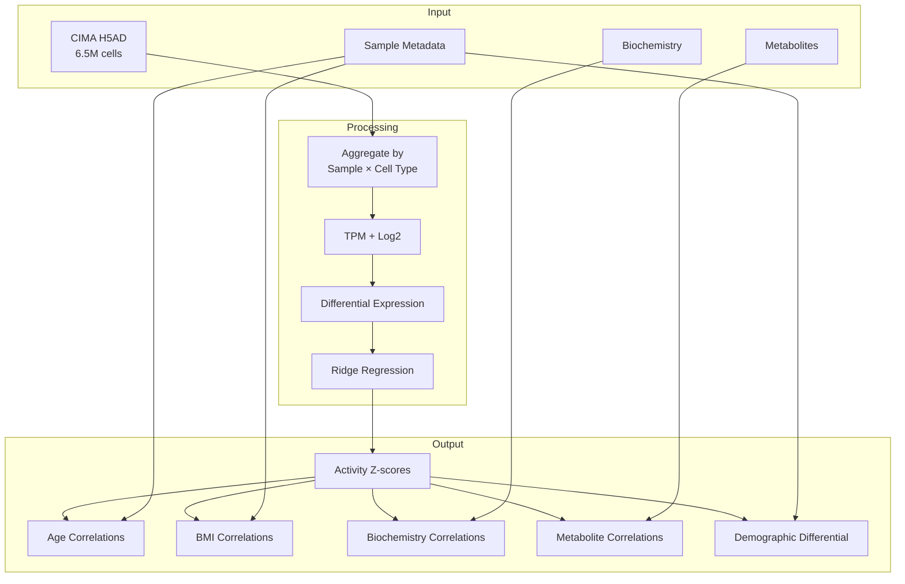

# CIMA Activity Pipeline

Compute cytokine and secreted protein activities across the CIMA single-cell atlas and associate with patient metadata.

## Overview

| Property | Value |
|----------|-------|
| **Script** | `scripts/01_cima_activity.py` |
| **Input** | 6.5M cells, 428 samples |
| **Output** | Activity matrices + correlations |
| **Runtime** | ~2 hours (GPU) |
| **Memory** | ~32 GB |

## Input Dependencies

### Data Files

| File | Description | Size |
|------|-------------|------|
| `CIMA_RNA_6484974cells_36326genes_compressed.h5ad` | Single-cell data | ~45 GB |
| `CIMA_Sample_Blood_Biochemistry_Results.csv` | Blood biochemistry | ~50 KB |
| `CIMA_Sample_Plasma_Metabolites_and_Lipids_Results.csv` | Metabolomics | ~2 MB |
| `CIMA_Sample_Information_Metadata.csv` | Sample metadata | ~100 KB |

### Signature Matrices

| Signature | Proteins | Usage |
|-----------|----------|-------|
| CytoSig | 44 | Cytokine activities |
| SecAct | 1,249 | Secreted protein activities |

## Processing Pipeline



## Key Functions

### `aggregate_by_sample_celltype()`
Groups cells by sample and cell type, sums raw counts.

```python
# Location: scripts/01_cima_activity.py:102
def aggregate_by_sample_celltype(adata, cell_type_col, sample_col):
    """
    Aggregate expression by sample and cell type for pseudo-bulk analysis.

    Returns:
        expr_df: DataFrame (genes x sample_celltype combinations)
        meta_df: DataFrame with sample and cell type info
    """
```

### `run_activity_inference()`
Ridge regression against signature matrices.

```python
# Location: scripts/01_cima_activity.py:189
def run_activity_inference(expr_df, signature, sig_name, output_prefix):
    """
    Run SecActpy activity inference.

    Args:
        expr_df: Differential expression (genes x samples)
        signature: Signature matrix (genes x proteins)
        sig_name: Name for logging
        output_prefix: Prefix for output files
    """
```

### `correlation_analysis()`
Spearman correlations between activities and continuous variables.

```python
# Location: scripts/01_cima_activity.py:288
def correlation_analysis(activity_df, metadata_df, feature_cols, sample_col, agg_meta_df):
    """
    Compute Spearman correlations between activities and continuous variables.
    """
```

## Output Files

| File | Description | Size |
|------|-------------|------|
| `CIMA_CytoSig_pseudobulk.h5ad` | CytoSig activities | ~50 MB |
| `CIMA_SecAct_pseudobulk.h5ad` | SecAct activities | ~200 MB |
| `CIMA_correlation_age.csv` | Activity × age correlations | ~1 MB |
| `CIMA_correlation_bmi.csv` | Activity × BMI correlations | ~1 MB |
| `CIMA_correlation_biochemistry.csv` | Activity × biochemistry | ~5 MB |
| `CIMA_correlation_metabolites.csv` | Activity × metabolites | ~20 MB |
| `CIMA_differential_demographics.csv` | Sex/smoking differential | ~2 MB |

## Statistical Methods

### Correlation Analysis

Spearman correlation between sample-averaged activities and continuous variables:

```python
rho, pvalue = stats.spearmanr(activities, variable)
```

Output columns:
- `cell_type`: Cell type analyzed
- `signature`: Signature name (cytokine/protein)
- `feature`: Variable name (age, BMI, etc.)
- `rho`: Spearman correlation coefficient
- `pvalue`: Correlation p-value
- `fdr`: FDR-corrected p-value

### Differential Analysis

Wilcoxon rank-sum test for categorical comparisons:

```python
stat, pvalue = stats.mannwhitneyu(group1, group2, alternative='two-sided')
```

Output columns:
- `cell_type`: Cell type analyzed
- `signature`: Signature name
- `comparison`: Comparison name (e.g., "sex_Male_vs_Female")
- `median_g1`, `median_g2`: Group medians
- `activity_diff`: group1_mean - group2_mean
- `pvalue`: Test p-value
- `fdr`: FDR-corrected p-value

## Execution

### SLURM

```bash
sbatch scripts/slurm/run_cima.sh
```

### Direct

```bash
cd /data/parks34/projects/2secactpy
source ~/bin/myconda && conda activate secactpy
python scripts/01_cima_activity.py --mode pseudobulk
```

### Mode Options

| Mode | Description |
|------|-------------|
| `pseudobulk` | Aggregate by sample × cell type (default) |
| `singlecell` | Per-cell activity (memory intensive) |
| `both` | Both modes |

## Panel Analyses

- Age/BMI/Biochemistry Correlations
- Metabolite Analysis
- Sex/Smoking Differential
