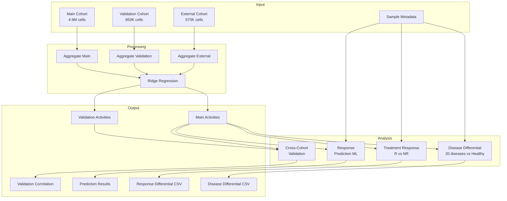

# Inflammation Activity Pipeline

Compute cytokine and secreted protein activities across the Inflammation Atlas and analyze disease-associated patterns and treatment response.

## Overview

| Property | Value |
|----------|-------|
| **Script** | `scripts/02_inflam_activity.py` |
| **Input** | 6.3M cells, 1,047 samples, 20 diseases |
| **Output** | Activity matrices + disease/treatment analysis |
| **Runtime** | ~3 hours (GPU) |
| **Memory** | ~48 GB |

## Input Dependencies

### Data Files

| File | Description | Cells |
|------|-------------|-------|
| `INFLAMMATION_ATLAS_main_afterQC.h5ad` | Main cohort | 4,918,140 |
| `INFLAMMATION_ATLAS_validation_afterQC.h5ad` | Validation cohort | 849,922 |
| `INFLAMMATION_ATLAS_external_afterQC.h5ad` | External cohort | 572,872 |
| `INFLAMMATION_ATLAS_afterQC_sampleMetadata.csv` | Sample metadata | 1,047 samples |

### Signature Matrices

| Signature | Proteins | Usage |
|-----------|----------|-------|
| CytoSig | 44 | Cytokine activities |
| SecAct | 1,249 | Secreted protein activities |

## Processing Pipeline



## Key Functions

### `disease_differential_analysis()`
Compare disease groups against healthy controls.

```python
# Location: scripts/02_inflam_activity.py:280
def disease_differential_analysis(activity_df, sample_meta, agg_meta_df, group_col='disease'):
    """
    Compute differential activity between disease groups and healthy.

    Uses Wilcoxon rank-sum test with FDR correction.
    """
```

### `treatment_response_analysis()`
Compare responders vs non-responders.

```python
# Location: scripts/02_inflam_activity.py:350
def treatment_response_analysis(activity_df, sample_meta, agg_meta_df):
    """
    Compute differential activity between treatment responders and non-responders.
    """
```

### `build_response_predictor()`
Machine learning prediction of treatment response.

```python
# Location: scripts/02_inflam_activity.py:420
def build_response_predictor(activity_df, sample_meta, agg_meta_df):
    """
    Build predictive models for treatment response.

    Uses Logistic Regression and Random Forest with cross-validation.
    """
```

### `cross_cohort_validation()`
Validate findings across cohorts.

```python
# Location: scripts/02_inflam_activity.py:500
def cross_cohort_validation(main_activity, val_activity, main_meta, val_meta):
    """
    Validate activity patterns across cohorts.

    Computes Spearman correlation between main and validation cohort activities.
    """
```

## Output Files

| File | Description | Size |
|------|-------------|------|
| `main_CytoSig_pseudobulk.h5ad` | CytoSig activities (main) | ~100 MB |
| `main_SecAct_pseudobulk.h5ad` | SecAct activities (main) | ~400 MB |
| `validation_CytoSig_pseudobulk.h5ad` | CytoSig activities (validation) | ~20 MB |
| `disease_differential.csv` | Disease vs healthy comparison | ~5 MB |
| `response_differential.csv` | R vs NR comparison | ~2 MB |
| `response_prediction_results.csv` | ML prediction results | ~1 MB |
| `cohort_validation_correlation.csv` | Main vs validation correlation | ~500 KB |

## Statistical Methods

### Disease Differential

For each disease group vs healthy:

```python
# Wilcoxon rank-sum test
stat, pvalue = stats.mannwhitneyu(disease_activities, healthy_activities)

# Activity difference (not log2 fold change!)
activity_diff = disease_mean - healthy_mean
```

Output columns:
- `disease`: Disease name
- `cell_type`: Cell type
- `signature`: Cytokine/protein
- `activity_diff`: disease_mean - healthy_mean
- `pvalue`: Wilcoxon p-value
- `fdr`: FDR-corrected p-value
- `n_disease`, `n_healthy`: Sample counts

### Treatment Response Prediction

Cross-validated machine learning:

```python
from sklearn.linear_model import LogisticRegression
from sklearn.ensemble import RandomForestClassifier
from sklearn.model_selection import StratifiedKFold

# Logistic regression with L2 regularization
lr = LogisticRegression(penalty='l2', C=1.0)

# Random forest
rf = RandomForestClassifier(n_estimators=100, max_depth=10)

# 5-fold stratified cross-validation
cv = StratifiedKFold(n_splits=5, shuffle=True)
```

### Cross-Cohort Validation

Correlation between cohort-averaged activities:

```python
# Aggregate by cell type × disease
main_avg = main_activity.groupby(['cell_type', 'disease']).mean()
val_avg = val_activity.groupby(['cell_type', 'disease']).mean()

# Spearman correlation
rho, pvalue = stats.spearmanr(main_avg, val_avg)
```

## Execution

### SLURM

```bash
sbatch scripts/slurm/run_inflam.sh
```

### Direct

```bash
cd /data/parks34/projects/2secactpy
source ~/bin/myconda && conda activate secactpy
python scripts/02_inflam_activity.py --mode both
```

## Panel Analyses

- [Disease Activity Differential](panels/disease.md)
- [Treatment Response](panels/treatment.md)
- [Cross-Cohort Validation](panels/validation.md)
