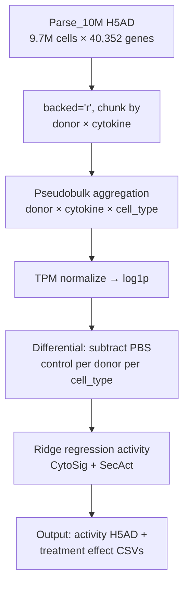
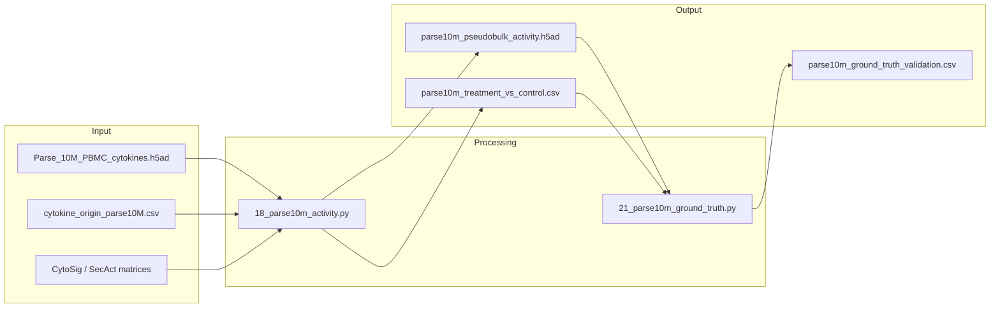

# parse_10M Activity Pipeline

## Overview

| Property | Value |
|----------|-------|
| **Script** | `scripts/18_parse10m_activity.py` |
| **Runtime** | ~24 hours |
| **Memory** | ~128 GB |
| **GPU** | A100 (CuPy acceleration) |

## Input Dependencies

### Data Files
| File | Description | Size |
|------|-------------|------|
| `Parse_10M_PBMC_cytokines.h5ad` | 9.7M cytokine-treated PBMCs | 212 GB |
| `cytokine_origin_parse10M.csv` | Cytokine metadata (families, concentrations) | <1 MB |

### Signature Matrices
| Signature | Proteins | Source |
|-----------|----------|--------|
| CytoSig | 44 | `load_cytosig()` |
| SecAct | 1,249 | `load_secact()` |

## Processing Steps



### Step 1: Chunked Loading
```python
# Load in backed mode (212 GB file)
adata = ad.read_h5ad(H5AD_PATH, backed='r')
# Chunk by donor × cytokine (1,092 groups)
groups = adata.obs.groupby(['donor_id', 'cytokine'], observed=True).groups
```

### Step 2: Pseudobulk Aggregation
```python
# Aggregate: donor × cytokine × cell_type
# 12 donors × 91 conditions × ~18 cell types = ~19,656 pseudobulk profiles
expr_df, meta_df = aggregate_by_sample_celltype(adata, 'cell_type', 'sample_id')
```

### Step 3: Normalization
```python
# TPM normalize (counts per million) and log1p transform
expr_log = normalize_and_transform(expr_df)
```

### Step 4: Treatment vs Control Differential
```python
# For each donor and cell_type, subtract PBS control
# treatment_effect = treated_activity - pbs_activity
for donor in donors:
    for cell_type in cell_types:
        pbs_profile = expr_log[(donor, 'PBS', cell_type)]
        for cytokine in cytokines:
            treated_profile = expr_log[(donor, cytokine, cell_type)]
            diff_profile = treated_profile - pbs_profile
```

### Step 5: Activity Inference
```python
# Ridge regression against signature matrices
result_cytosig = run_activity_inference(expr_diff, cytosig, 'CytoSig')
result_secact = run_activity_inference(expr_diff, secact, 'SecAct')
```

## Ground Truth Validation {#ground-truth}

Script: `scripts/21_parse10m_ground_truth.py` (~8 hours)

### Self-Signature Test
For each of the 44 CytoSig cytokines that overlap with the 90 tested:
1. Compute activity for all 44 signatures in cells treated with cytokine X
2. Compare activity of signature X (self) vs all other signatures (non-self)
3. Metric: AUC-ROC for self-signature detection, rank of self-signature

### Cell Type Specificity
For each cytokine, identify which cell types show the strongest response. Validate against known biology (e.g., IL-17 → Th17, IFNγ → CD8/NK).

### Cross-Donor Consistency
Spearman correlation of activity profiles across 12 donors per cytokine × cell_type combination.

## Output Files

| File | Description | Size |
|------|-------------|------|
| `results/parse10m/parse10m_pseudobulk_activity.h5ad` | Activity matrix (donor × cytokine × cell_type × signature) | ~500 MB |
| `results/parse10m/parse10m_treatment_vs_control.csv` | Treatment effect per cytokine per cell_type | ~50 MB |
| `results/parse10m/parse10m_cytokine_response_matrix.csv` | 90 cytokines × 18 cell types heatmap data | ~5 MB |
| `results/parse10m/parse10m_ground_truth_validation.csv` | Predicted vs actual cytokine response | ~1 MB |

## Key Parameters

| Parameter | Default | Description |
|-----------|---------|-------------|
| `BATCH_SIZE` | 10000 | Cells per batch for single-cell analysis |
| `N_RAND` | 1000 | Permutations for p-value calculation |
| `LAMBDA` | 5e5 | Ridge regression regularization |

## Execution

### SLURM
```bash
# Via jobs.yaml
python scripts/slurm/submit_jobs.py --job parse10m
python scripts/slurm/submit_jobs.py --job parse10m_ground_truth
```

### Direct
```bash
cd /data/parks34/projects/2cytoatlas
python scripts/18_parse10m_activity.py --mode pseudobulk
python scripts/21_parse10m_ground_truth.py
```

## Data Lineage



## Related Panels

- Perturbation Page → Cytokine Response tab (heatmap)
- Perturbation Page → Ground Truth tab (scatter)
