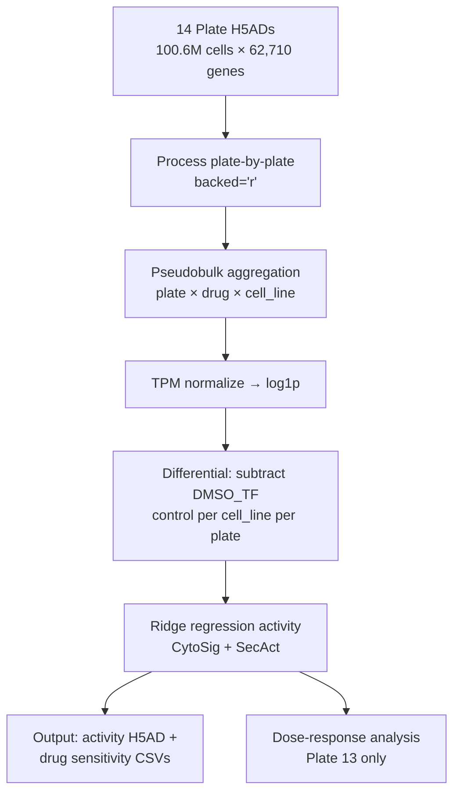
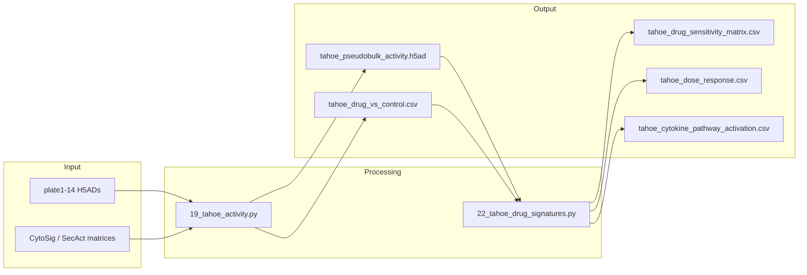

# Tahoe Drug Response Pipeline

## Overview

| Property | Value |
|----------|-------|
| **Script** | `scripts/19_tahoe_activity.py` |
| **Runtime** | ~48 hours |
| **Memory** | ~128-256 GB |
| **GPU** | A100 (CuPy acceleration) |

## Input Dependencies

### Data Files
| File | Description | Size |
|------|-------------|------|
| `plate{1-14}_filt_Vevo_Tahoe100M_WServicesFrom_ParseGigalab.h5ad` | 14 plate H5ADs | 4.7-35 GB each, 314 GB total |

### Signature Matrices
| Signature | Proteins | Source |
|-----------|----------|--------|
| CytoSig | 44 | `load_cytosig()` |
| SecAct | 1,249 | `load_secact()` |

## Processing Steps



### Step 1: Plate-by-Plate Loading
```python
import os, anndata as ad

TAHOE_DIR = '/data/Jiang_Lab/Data/Seongyong/tahoe/'
for plate_num in range(1, 15):
    plate_file = f'plate{plate_num}_filt_Vevo_Tahoe100M_WServicesFrom_ParseGigalab.h5ad'
    adata = ad.read_h5ad(os.path.join(TAHOE_DIR, plate_file), backed='r')
    # Process each plate independently
```

### Step 2: Pseudobulk Aggregation
```python
# Per plate: aggregate by drug × cell_line
# ~14 plates × 95 drugs × 50 cell lines = ~66,500 pseudobulk profiles
expr_df, meta_df = aggregate_by_sample_celltype(adata, 'cell_line', 'drug')
```

### Step 3: Normalization
```python
expr_log = normalize_and_transform(expr_df)
```

### Step 4: Drug vs Control Differential
```python
# For each cell_line and plate, subtract DMSO_TF control
for cell_line in cell_lines:
    dmso_profile = expr_log[(plate, 'DMSO_TF', cell_line)]
    for drug in drugs:
        treated_profile = expr_log[(plate, drug, cell_line)]
        diff_profile = treated_profile - dmso_profile
```

### Step 5: Activity Inference
```python
result_cytosig = run_activity_inference(expr_diff, cytosig, 'CytoSig')
result_secact = run_activity_inference(expr_diff, secact, 'SecAct')
```

### Step 6: Dose-Response (Plate 13)
```python
# Plate 13: 3 doses × 25 drugs × 50 cell lines
# Check for dose-response monotonicity
plate13 = ad.read_h5ad(PLATE_13, backed='r')
for drug in plate13_drugs:
    for cell_line in cell_lines:
        activities_by_dose = get_activities(drug, cell_line, doses=[0.1, 1.0, 10.0])
        # Verify monotonic activity change with dose
```

## Drug Sensitivity Signature Extraction

Script: `scripts/22_tahoe_drug_signatures.py` (~8 hours)

### Pathway Activation
For each drug, identify which cytokine/secreted protein pathways are activated or suppressed across cell lines:
- Kinase inhibitors → expected MAPK/ERK pathway suppression
- Proteasome inhibitors → expected NF-κB pathway effects

### Drug-Pathway Validation
Known drug-target associations for validation:
- Trametinib (MEK inhibitor) → MAPK-related cytokine suppression
- Bortezomib (proteasome inhibitor) → NF-κB pathway activity change

## Output Files

| File | Description | Size |
|------|-------------|------|
| `results/tahoe/tahoe_pseudobulk_activity.h5ad` | Activity matrix (plate × drug × cell_line × signature) | ~2 GB |
| `results/tahoe/tahoe_drug_vs_control.csv` | Drug - DMSO differential | ~200 MB |
| `results/tahoe/tahoe_drug_sensitivity_matrix.csv` | 95 drugs × 50 cell lines sensitivity | ~50 MB |
| `results/tahoe/tahoe_dose_response.csv` | Plate 13 dose-response curves | ~10 MB |
| `results/tahoe/tahoe_cytokine_pathway_activation.csv` | Drug → cytokine pathway mapping | ~5 MB |

## Key Parameters

| Parameter | Default | Description |
|-----------|---------|-------------|
| `BATCH_SIZE` | 10000 | Cells per batch for single-cell analysis |
| `N_RAND` | 1000 | Permutations for p-value calculation |
| `LAMBDA` | 5e5 | Ridge regression regularization |

## Execution

### SLURM
```bash
python scripts/slurm/submit_jobs.py --job tahoe
python scripts/slurm/submit_jobs.py --job tahoe_drug_sigs
```

### Direct
```bash
cd /data/parks34/projects/2secactpy
python scripts/19_tahoe_activity.py --mode all
python scripts/22_tahoe_drug_signatures.py
```

## Data Lineage



## Related Panels

- Perturbation Page → Drug Sensitivity tab (heatmap)
- Perturbation Page → Dose-Response tab (line charts)
- Perturbation Page → Pathway Activation tab (bar/heatmap)
