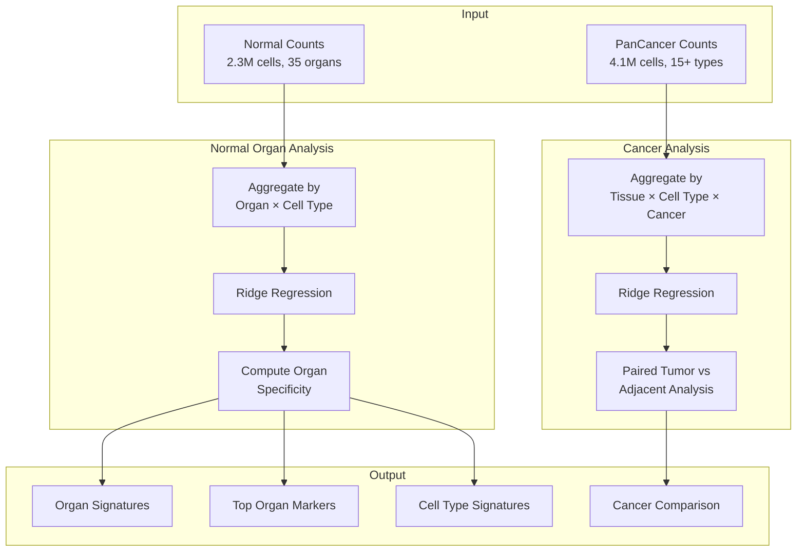

# scAtlas Analysis Pipeline

Compute cytokine and secreted protein activities from raw counts in the scAtlas datasets, analyzing organ-specific signatures and tumor microenvironment patterns.

## Overview

| Property | Value |
|----------|-------|
| **Script** | `scripts/03_scatlas_analysis.py` |
| **Input** | 6.4M cells (2.3M normal + 4.1M cancer) |
| **Output** | Organ signatures, cancer comparison |
| **Runtime** | ~4 hours (GPU) |
| **Memory** | ~64 GB |

## Input Dependencies

### Data Files

| File | Description | Cells |
|------|-------------|-------|
| `igt_s9_fine_counts.h5ad` | Normal organ counts | 2,293,951 |
| `PanCancer_igt_s9_fine_counts.h5ad` | PanCancer counts | 4,146,975 |

### Signature Matrices

| Signature | Proteins | Usage |
|-----------|----------|-------|
| CytoSig | 44 | Cytokine activities |
| SecAct | 1,249 | Secreted protein activities |

## Processing Pipeline



## Key Functions

### `aggregate_by_tissue_celltype()`
Chunked aggregation for memory efficiency.

```python
# Location: scripts/03_scatlas_analysis.py:77
def aggregate_by_tissue_celltype(adata, tissue_col, celltype_col, min_cells=50,
                                  extra_cols=None, group_cols=None, chunk_size=50000):
    """
    Aggregate expression by tissue and cell type for pseudo-bulk analysis.

    Uses chunked reading for efficiency with backed mode.

    Args:
        min_cells: Minimum cells per group (default: 50)
        chunk_size: Cells per chunk for reading (default: 50000)
    """
```

### `compute_organ_specificity()`
Calculate organ-specific signature scores.

```python
# Location: scripts/03_scatlas_analysis.py:350
def compute_organ_specificity(activity_df, meta_df):
    """
    Compute organ specificity scores for each signature.

    Specificity = (organ_mean - other_mean) / pooled_std
    """
```

### `paired_tumor_adjacent_analysis()`
Compare tumor vs adjacent with donor pairing.

```python
# Location: scripts/03_scatlas_analysis.py:450
def paired_tumor_adjacent_analysis(activity_df, meta_df):
    """
    Paired comparison of Tumor vs Adjacent within same donors.

    Uses paired t-test for statistical testing.
    """
```

## Output Files

### Normal Organs

| File | Description | Size |
|------|-------------|------|
| `normal_organ_signatures.csv` | Organ × signature activities | ~5 MB |
| `normal_top_organ_signatures.csv` | Top 10 per organ | ~500 KB |
| `normal_celltype_signatures.csv` | Cell type × signature | ~30 MB |

### PanCancer

| File | Description | Size |
|------|-------------|------|
| `cancer_comparison.csv` | Tumor vs Adjacent differential | ~10 MB |
| `cancer_celltype_activity.csv` | Cell type activities in TME | ~20 MB |
| `scatlas_cancer_CytoSig_singlecell.h5ad` | Single-cell CytoSig | ~5 GB |
| `scatlas_cancer_SecAct_singlecell.h5ad` | Single-cell SecAct | ~15 GB |

## Statistical Methods

### Organ Specificity

For each organ and signature:

```python
# Specificity score
organ_mean = activity[organ_mask].mean()
other_mean = activity[~organ_mask].mean()
pooled_std = activity.std()

specificity = (organ_mean - other_mean) / pooled_std
```

### Paired Tumor-Adjacent Comparison

For donors with both Tumor and Adjacent samples:

```python
# Paired t-test
from scipy.stats import ttest_rel

# Get paired values
tumor_vals = activity[(donor == d) & (tissue == 'Tumor')]
adjacent_vals = activity[(donor == d) & (tissue == 'Adjacent')]

# Activity difference
activity_diff = tumor_vals.mean() - adjacent_vals.mean()

# Statistical test
t_stat, pvalue = ttest_rel(tumor_vals, adjacent_vals)
```

## Execution

### SLURM

```bash
sbatch scripts/slurm/run_scatlas.sh
```

### Direct

```bash
cd /data/parks34/projects/2secactpy
source ~/bin/myconda && conda activate secactpy
python scripts/03_scatlas_analysis.py
```

## Memory Considerations

Due to the large dataset size:

1. **Backed mode**: Always use `backed='r'` for H5AD files
2. **Chunked processing**: Process cells in chunks (default: 50K)
3. **Garbage collection**: Explicit `gc.collect()` after processing

```python
# Efficient loading
adata = ad.read_h5ad(path, backed='r')

# Chunked aggregation
for chunk_i in range(n_chunks):
    chunk_X = X[start:end, :]
    # Process chunk...
    gc.collect()
```

## Panel Analyses

- Organ Signatures
- Cancer Comparison
- T Cell Exhaustion

## Related Pipelines

- Immune Infiltration Analysis (`scripts/08_scatlas_immune_analysis.py`)
