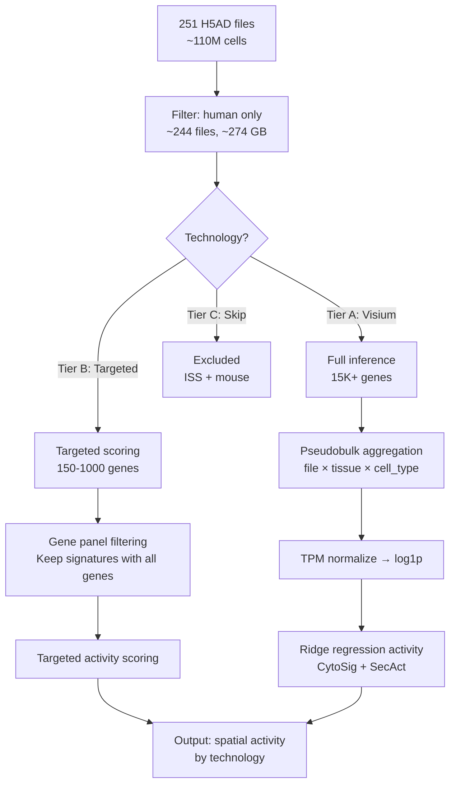
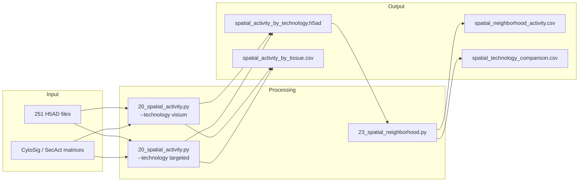

# SpatialCorpus Activity Pipeline

## Overview

| Property | Value |
|----------|-------|
| **Script** | `scripts/20_spatial_activity.py` |
| **Runtime** | ~48-72 hours (Visium) + ~24 hours (targeted) |
| **Memory** | ~128-256 GB |
| **GPU** | A100 (CuPy acceleration) |

## Input Dependencies

### Data Files
| File | Description | Size |
|------|-------------|------|
| `SpatialCorpus-110M/*.h5ad` | 251 spatial transcriptomics datasets | 377 GB total |

### Signature Matrices
| Signature | Proteins | Source |
|-----------|----------|--------|
| CytoSig | 44 | `load_cytosig()` |
| SecAct | 1,249 | `load_secact()` |

## Technology Stratification

```
Tier A: Full Inference (Visium, ~171 files, 15K+ genes)
├── Full CytoSig ridge regression (44 signatures)
└── Full SecAct ridge regression (1,249 signatures)

Tier B: Targeted Scoring (Xenium, MERFISH, MERSCOPE, CosMx, ~51 files, 150-1000 genes)
├── Subset signatures where ALL genes present in panel
└── Reduced signature set (varies by dataset)

Tier C: Skip (ISS 3 files, mouse Slide-seq 9 files)
├── ISS: too few genes for any inference
└── Mouse: wrong species (human-only analysis)
```

## Processing Steps



### Step 1: Dataset Cataloging
```python
import glob, anndata as ad

SPATIAL_DIR = '/data/Jiang_Lab/Data/Seongyong/SpatialCorpus-110M/'
h5ad_files = glob.glob(os.path.join(SPATIAL_DIR, '**/*.h5ad'), recursive=True)

# Classify by technology tier
tier_a = [f for f in h5ad_files if is_visium(f)]       # ~171 files
tier_b = [f for f in h5ad_files if is_targeted(f)]      # ~51 files
tier_c = [f for f in h5ad_files if should_skip(f)]      # ~12 files (ISS + mouse)
```

### Step 2: Gene Panel Coverage Check
```python
from secactpy import load_cytosig
cytosig = load_cytosig()
cytosig_genes = set(cytosig.index)

# For each dataset, compute coverage
for h5ad_file in tier_b:
    adata = ad.read_h5ad(h5ad_file, backed='r')
    dataset_genes = set(adata.var_names)
    overlap = dataset_genes & cytosig_genes
    coverage = len(overlap) / len(cytosig_genes)
    # Only use signatures where ALL genes are present
```

### Step 3: Technology-Stratified Pseudobulk
```python
# Tier A: Standard pseudobulk (file × tissue × cell_type)
expr_df, meta_df = aggregate_by_sample_celltype(adata, cell_type_col, tissue_col)

# Tier B: Targeted — filter signature matrix to available genes first
available_sigs = filter_signatures_by_gene_coverage(cytosig, dataset_genes, min_coverage=1.0)
```

### Step 4: Activity Inference
```python
# Tier A: Full ridge regression
result = run_activity_inference(expr_diff, cytosig, 'CytoSig')

# Tier B: Targeted scoring (subset signatures only)
cytosig_subset = cytosig[available_genes, available_sigs]
result = run_activity_inference(expr_diff, cytosig_subset, 'CytoSig_targeted')
```

## Spatial Neighborhood Analysis

Script: `scripts/23_spatial_neighborhood.py` (~16 hours)

### Niche-Level Activity
For datasets with spatial coordinates and NicheFormer embeddings:
1. Define local neighborhoods (k-nearest neighbors in spatial coordinates)
2. Aggregate activity within each neighborhood
3. Identify spatial gradients (e.g., immune infiltration fronts in tumors)

### Known Spatial Patterns for Validation
- Immune infiltration gradients in tumors
- Zonal patterns in liver (periportal vs pericentral)
- Layer-specific patterns in cortex

## Output Files

| File | Description | Size |
|------|-------------|------|
| `results/spatial/spatial_activity_by_technology.h5ad` | Activity per technology × tissue × cell_type | ~1 GB |
| `results/spatial/spatial_activity_by_tissue.csv` | Tissue-level activity summary | ~50 MB |
| `results/spatial/spatial_neighborhood_activity.csv` | Niche-level activity patterns | ~100 MB |
| `results/spatial/spatial_technology_comparison.csv` | Cross-technology reproducibility | ~10 MB |

## Key Parameters

| Parameter | Default | Description |
|-----------|---------|-------------|
| `BATCH_SIZE` | 10000 | Cells per batch for single-cell analysis |
| `N_RAND` | 1000 | Permutations for p-value calculation |
| `LAMBDA` | 5e5 | Ridge regression regularization |
| `MIN_GENE_COVERAGE` | 1.0 | Minimum fraction of signature genes required (Tier B) |
| `N_NEIGHBORS` | 30 | k-nearest neighbors for spatial neighborhoods |

## Execution

### SLURM
```bash
# Visium (Tier A) and targeted (Tier B) can run in parallel
python scripts/slurm/submit_jobs.py --job spatial_visium
python scripts/slurm/submit_jobs.py --job spatial_targeted

# Neighborhood analysis depends on both
python scripts/slurm/submit_jobs.py --job spatial_neighborhood
```

### Direct
```bash
cd /data/parks34/projects/2cytoatlas
python scripts/20_spatial_activity.py --technology visium
python scripts/20_spatial_activity.py --technology targeted
python scripts/23_spatial_neighborhood.py
```

## Data Lineage



## Related Panels

- Spatial Page → Tissue Activity tab (heatmap)
- Spatial Page → Technology Comparison tab (scatter)
- Spatial Page → Gene Coverage tab (bar chart)
- Spatial Page → Spatial Map tab (coordinate plot)
