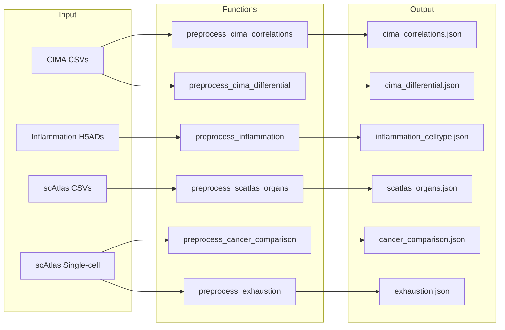

# Visualization Preprocessing Pipeline

Preprocess analysis results into JSON files optimized for the web dashboard.

## Overview

| Property | Value |
|----------|-------|
| **Script** | `scripts/06_preprocess_viz_data.py` |
| **Input** | CSV/H5AD files from analysis pipelines |
| **Output** | 30+ JSON files for web visualization |
| **Runtime** | ~30 minutes |
| **Memory** | ~16 GB |

## Input Dependencies

| Directory | Files | Description |
|-----------|-------|-------------|
| `results/cima/` | Correlation/differential CSVs | CIMA analysis results |
| `results/inflammation/` | Activity H5ADs, differential CSVs | Inflammation results |
| `results/scatlas/` | Organ/cancer CSVs, single-cell H5ADs | scAtlas results |

## Processing Pipeline



## Key Functions

### CIMA Preprocessing

```python
# Location: scripts/06_preprocess_viz_data.py:30
def preprocess_cima_correlations():
    """
    Preprocess CIMA correlation data for visualization.

    Combines age, BMI, and biochemistry correlations.
    Outputs: cima_correlations.json
    """

# Location: scripts/06_preprocess_viz_data.py:91
def preprocess_cima_differential():
    """
    Preprocess CIMA differential analysis results.

    Calculates activity_diff and -log10(pvalue) for volcano plots.
    Outputs: cima_differential.json
    """
```

### Inflammation Preprocessing

```python
# Location: scripts/06_preprocess_viz_data.py:117
def preprocess_inflammation():
    """
    Preprocess Inflammation Atlas data from H5AD files.

    Aggregates by cell type across samples.
    Outputs: inflammation_celltype.json
    """
```

### scAtlas Preprocessing

```python
# Location: scripts/06_preprocess_viz_data.py:184
def preprocess_scatlas_organs():
    """
    Preprocess scAtlas organ signature data.

    Includes both CytoSig and SecAct signatures.
    Outputs: scatlas_organs.json, scatlas_organs_top.json
    """

# Location: scripts/06_preprocess_viz_data.py:292
def preprocess_cancer_comparison():
    """
    Preprocess Tumor vs Adjacent comparison with paired donor analysis.

    Uses single-cell activities for paired statistical testing.
    Outputs: cancer_comparison.json
    """
```

## Output JSON Files

### CIMA

| File | Records | Size | Description |
|------|---------|------|-------------|
| `cima_correlations.json` | ~10K | ~3 MB | Age/BMI/biochemistry correlations |
| `cima_differential.json` | ~5K | ~3 MB | Sex/smoking differential |
| `cima_metabolites_top.json` | 500 | ~85 KB | Top metabolite correlations |
| `cima_celltype.json` | ~5K | ~4 MB | Cell type activities |
| `cima_biochem_scatter.json` | ~10K | ~8 MB | Biochemistry scatter data |
| `cima_eqtl.json` | ~50K | ~15 MB | eQTL associations |

### Inflammation

| File | Records | Size | Description |
|------|---------|------|-------------|
| `inflammation_celltype.json` | ~80K | ~5 MB | Cell type activities |
| `inflammation_disease.json` | ~200K | ~288 MB | Disease differential (full) |
| `inflammation_disease_filtered.json` | ~50K | ~59 MB | Disease differential (filtered) |
| `inflammation_differential.json` | ~10K | ~2 MB | Key differentials |
| `inflammation_severity.json` | ~30K | ~11 MB | Disease severity |
| `treatment_response.json` | ~5K | ~240 KB | Treatment response |
| `cohort_validation.json` | ~3K | ~186 KB | Cross-cohort validation |

### scAtlas

| File | Records | Size | Description |
|------|---------|------|-------------|
| `scatlas_organs.json` | ~50K | ~6 MB | Organ signatures |
| `scatlas_organs_top.json` | ~500 | ~132 KB | Top organ markers |
| `scatlas_celltypes.json` | ~100K | ~31 MB | Cell type signatures |
| `cancer_comparison.json` | ~20K | ~262 KB | Tumor vs Adjacent |
| `exhaustion.json` | ~10K | ~6 MB | T cell exhaustion |
| `immune_infiltration.json` | ~50K | ~38 MB | Immune infiltration |

### Cross-Atlas

| File | Records | Size | Description |
|------|---------|------|-------------|
| `cross_atlas.json` | ~1K | ~190 KB | Atlas comparison |
| `search_index.json` | ~10K | ~332 KB | Global search index |
| `summary_stats.json` | 1 | ~2 KB | Project summary |

## JSON Schema Examples

### Correlation Data

```json
{
  "age": [
    {
      "cell_type": "CD4+ T",
      "signature": "IL2",
      "signature_type": "CytoSig",
      "rho": 0.234,
      "pvalue": 0.001,
      "fdr": 0.01
    }
  ]
}
```

### Differential Data

```json
{
  "cell_type": "Monocyte",
  "signature": "TNFA",
  "comparison": "sex_Male_vs_Female",
  "median_g1": 0.52,
  "median_g2": 0.31,
  "activity_diff": 0.21,
  "pvalue": 0.0001,
  "neg_log10_pval": 4.0
}
```

### Cancer Comparison

```json
{
  "data": [
    {
      "cell_type": "CAF",
      "signature": "TGFB1",
      "signature_type": "CytoSig",
      "mean_tumor": 0.85,
      "mean_adjacent": -0.12,
      "mean_difference": 0.97,
      "n_pairs": 45,
      "p_value": 0.000001
    }
  ],
  "cell_types": ["CAF", "TAM", "CD8+ Tex", ...],
  "cytosig_signatures": ["IL1B", "IL6", "TNFA", ...],
  "secact_signatures": ["MMP1", "MMP9", ...],
  "n_paired_donors": 150,
  "analysis_type": "paired_singlecell"
}
```

## Data Transformations

### Float Rounding

Reduce JSON size by rounding floats:

```python
def round_floats(df, decimals=4):
    float_cols = df.select_dtypes(include=['float64', 'float32']).columns
    for col in float_cols:
        df[col] = df[col].round(decimals)
    return df
```

### Activity Difference

For volcano plots, compute activity difference (not log2 fold change):

```python
# Z-scores can be negative, so use difference
df['activity_diff'] = df['median_g1'] - df['median_g2']
df['neg_log10_pval'] = -np.log10(df['pvalue'].clip(lower=1e-300))
```

### Filtering

For large datasets, filter to reduce file size:

```python
# Top signatures by variance
top_sigs = df.groupby('signature')['activity'].var().nlargest(100).index

# Significant results only
significant = df[df['fdr'] < 0.05]
```

## Execution

```bash
cd /data/parks34/projects/2cytoatlas
source ~/bin/myconda && conda activate secactpy
python scripts/06_preprocess_viz_data.py
```

## Output Location

All JSON files are written to:
```
/data/parks34/projects/2cytoatlas/visualization/data/
```

## Related

- [JSON Catalog](../../outputs/visualization/index.md)
- [API Mapping](../../outputs/visualization/api_mapping.md)
- [Panel Mapping](../../outputs/visualization/panel_mapping.md)
