# {PIPELINE_NAME} Pipeline

## Overview

| Property | Value |
|----------|-------|
| **Script** | `{SCRIPT_PATH}` |
| **Runtime** | ~{RUNTIME} |
| **Memory** | ~{MEMORY} GB |
| **GPU** | {GPU_USAGE} |

## Input Dependencies

### Data Files
| File | Description | Size |
|------|-------------|------|
| `{INPUT_FILE}` | {DESCRIPTION} | {SIZE} |

### Signature Matrices
| Signature | Proteins | Source |
|-----------|----------|--------|
| CytoSig | 44 | `load_cytosig()` |
| SecAct | 1,249 | `load_secact()` |

## Processing Steps

```mermaid
flowchart TD
    A[Raw Counts H5AD] --> B[Aggregate by Sample × Cell Type]
    B --> C[TPM Normalize]
    C --> D[Log2 Transform]
    D --> E[Compute Differential]
    E --> F[Ridge Regression]
    F --> G[Activity Z-scores]
    G --> H[Statistical Analysis]
```



### Step 1: Aggregation
```python
# Function: aggregate_by_sample_celltype()
# Groups cells by sample and cell type, sums raw counts
expr_df, meta_df = aggregate_by_sample_celltype(adata, cell_type_col, sample_col)
```

### Step 2: Normalization
```python
# Function: normalize_and_transform()
# TPM normalize (counts per million) and log2 transform
expr_log = normalize_and_transform(expr_df)
```

### Step 3: Differential Expression
```python
# Function: compute_differential()
# Subtract row mean to get differential expression
expr_diff = compute_differential(expr_log)
```

### Step 4: Activity Inference
```python
# Function: run_activity_inference()
# Ridge regression against signature matrices
result = run_activity_inference(expr_diff, signature, sig_name)
```

## Output Files

| File | Description | Size |
|------|-------------|------|
| `{OUTPUT_FILE}` | {DESCRIPTION} | {SIZE} |

## Key Parameters

| Parameter | Default | Description |
|-----------|---------|-------------|
| `BATCH_SIZE` | 10000 | Cells per batch for single-cell analysis |
| `N_RAND` | 1000 | Permutations for p-value calculation |
| `LAMBDA` | 5e5 | Ridge regression regularization |

## Execution

### SLURM
```bash
sbatch scripts/slurm/run_{ATLAS}.sh
```

### Direct
```bash
cd /data/parks34/projects/2secactpy
python scripts/{SCRIPT_NAME}
```

## Data Lineage

```mermaid
flowchart LR
    subgraph Input
        A[{INPUT_H5AD}]
        B[{METADATA_CSV}]
    end

    subgraph Processing
        C[{SCRIPT_NAME}]
    end

    subgraph Output
        D[{OUTPUT_CSV}]
        E[{OUTPUT_H5AD}]
    end

    A --> C
    B --> C
    C --> D
    C --> E
```

## Related Panels

- [{PANEL_NAME}](panels/{PANEL}.md)
